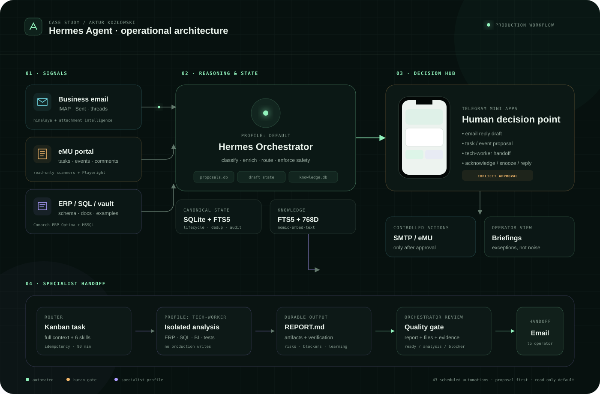

# Hermes Agent dla operacji ERP

[](https://arturkozlowski1988.github.io/hermes-erp-portfolio/)
[](docs/cron-orchestration.md)
[](docs/full-operational-workflow.md#safety-gates)
[](LICENSE)

**[Otwórz interaktywne portfolio →](https://arturkozlowski1988.github.io/hermes-erp-portfolio/)**

To case study mojego systemu operacyjnego zbudowanego na Hermes Agent. System łączy pocztę firmową, portal eMU, bazę wiedzy, Telegram Mini Apps, Kanban i osobny profil `tech-worker` do analiz SQL/ERP.

Nie jest to demonstracyjny chatbot. Workflow działa produkcyjnie: rozpoznaje sygnały, przygotowuje drafty, pokazuje decyzje w Telegramie, deleguje złożone sprawy i sprawdza trwały raport specjalisty.



## Co działa

### Drafty odpowiedzi e-mail

Himalaya pobiera INBOX oraz Sent. Hermes łączy wątek, załączniki, eMU i lokalną bazę wiedzy, a potem przygotowuje odpowiedź. Telegram Mini App pokazuje treść i kontekst. SMTP uruchamia dopiero moja akceptacja.

```text
IMAP → strict fetch → thread + Sent + KB → draft state
     → Telegram Mini App → moja decyzja → Reply-All SMTP
```

### Drafty zadań i wydarzeń

Wiadomość lub przypisane zadanie eMU może wymagać czegoś więcej niż odpowiedzi. Osobny scanner tworzy kanoniczną propozycję w SQLite. Decision Hub pozwala wybrać:

- draft odpowiedzi,
- propozycję zadania eMU,
- propozycję wydarzenia,
- przekazanie sprawy technicznej do `tech-worker`,
- pominięcie albo odrzucenie.

Propozycja nie jest wykonaniem. Write do eMU ma osobny handler i osobną zgodę.

### Handoff do tech-worker

Dla spraw SQL, Comarch ERP Optima, BI, integracji i wydruków orkiestrator przygotowuje pełną kartę Kanban. Zawiera źródło, komentarze, załączniki, zadania powiązane, skille, zasady testów i wymagany format raportu.

```text
proposal → filtr techniczny → Kanban + durable workspace
         → tech-worker → REPORT.md + artefakty
         → review orkiestratora → prywatny raport e-mail
```

`tech-worker` nie ma prawa zmieniać produkcji, pisać do eMU ani kontaktować się z klientem. Status `done` nie wystarcza. Orkiestrator sprawdza raport, pliki i dowody testów.

### eMU, komentarze i alerty

Skanery obserwują zadania, wydarzenia, anulowania i nowe komentarze. Zamiast surowego logu dostaję kartę z kontekstem oraz czterema decyzjami: załatwione, jutro, nie dotyczy, odpowiedz.

### Baza wiedzy

Prywatny SQLite przechowuje zsynchronizowane zgłoszenia, komentarze i rozwiązania. Retrieval łączy FTS5 z embeddings `nomic-embed-text` 768D. Wiedza wraca do kolejnych draftów i analiz.

### 43 aktywne automatyzacje

Cron control plane prowadzi synchronizację, drafty, proposals, routing, review, briefingi, backupy i health checks. Najważniejsze jobs są przesunięte minutowo:

```text
:01 eMU task scan      :05 proposal notifier
:03 email task scan    :07 tech-worker router
:04 dual-read check    :12 orchestrator review
                        :14 pipeline watchdog
```

Pełny wykaz: [docs/cron-orchestration.md](docs/cron-orchestration.md).

## Telegram Mini Apps

Portfolio pokazuje trzy rzeczywiste typy interfejsu:

1. **Email draft** — treść odpowiedzi, kontekst, załączniki, Wyślij/Pomiń.
2. **Proposal / Decision Hub** — źródło, confidence, plan zadania i routing.
3. **eMU notification** — komentarz, ryzyka, powiązania i akcje operacyjne.

Generator tworzy responsywny HTML z JSON. Prywatny Artifact Server działa w WSL, a Tailscale Serve udostępnia kartę Telegramowi po HTTPS. Callback waliduje allowlistę akcji i aktualny lifecycle.

## Architektura

| Warstwa | Technologia | Odpowiedzialność |
|---|---|---|
| orkiestrator | Hermes Agent | klasyfikacja, kontekst, routing, kontrola wyniku |
| interfejs | Telegram Gateway + Mini Apps | decyzje mobilne i briefingi |
| poczta | Himalaya | IMAP, Sent, SMTP, Reply-All |
| ERP portal | eMU + Playwright | zadania, wydarzenia, komentarze, załączniki |
| wiedza | SQLite, FTS5, embeddings | retrieval i historia rozwiązań |
| praca specjalisty | Kanban + durable workspace | assignment, leasing, raporty i artefakty |
| dane ERP | MSSQL / sqlcmd | schemat i weryfikacja na bazach testowych |
| host | WSL2 + Windows + Tailscale | usługi, przeglądarka i bezpieczny transport |

## Safety gates

| Operacja | Blokada |
|---|---|
| wysłanie e-maila | jawna akceptacja draftu |
| write do eMU | preview i osobna zgoda |
| zadanie dla specjalisty | Decision Hub + idempotency key |
| DDL/DML | tylko baza testowa, stan przed/po i rollback |
| wynik tech-worker | wymagany REPORT.md, artefakty i review |
| brak zdarzeń | `[SILENT]`, bez komunikatu „wszystko OK” |

## Dokumentacja

- [Pełny workflow operacyjny](docs/full-operational-workflow.md)
- [Pipeline poczty](docs/email-pipeline.md)
- [Workflow eMU](docs/emu-workflow.md)
- [Baza wiedzy](docs/knowledge-base.md)
- [43 jobs i rytm dnia](docs/cron-orchestration.md)
- [Stack techniczny](docs/tech-stack.md)
- [Przykład: draft e-mail](examples/email-draft-flow.md)
- [Przykład: sync wydarzeń eMU](examples/emu-event-sync.md)
- [Przykład: zapytanie do KB](examples/kb-query.md)

## Struktura repo

```text
.
├── index.html                       # interaktywna strona portfolio
├── assets/
│   ├── css/styles.css               # własny system wizualny
│   ├── js/app.js                    # workflow tabs + cron explorer
│   └── img/                         # diagram i social card
├── docs/
│   ├── full-operational-workflow.md # email/eMU → decyzja → tech-worker
│   ├── email-pipeline.md
│   ├── emu-workflow.md
│   ├── knowledge-base.md
│   └── cron-orchestration.md
├── examples/                        # zanonimizowane scenariusze
├── tests/site.test.mjs              # test struktury, SEO i dostępności
└── scripts/build.mjs                # sprawdzalny build do dist/
```

## Uruchomienie lokalne

Wymagany jest Node.js 20+.

```bash
npm test
npm run build
npm start
```

Strona będzie dostępna pod `http://localhost:4173`. Build najpierw uruchamia testy, a następnie kopiuje produkcyjne zasoby do `dist/`.

## Co zostało zanonimizowane

Repo nie zawiera:

- danych i nazw klientów,
- adresów e-mail,
- treści prywatnej bazy wiedzy,
- komentarzy i załączników z eMU,
- tokenów, haseł ani parametrów połączeń,
- produkcyjnych promptów zawierających dane operacyjne.

Mockupy Mini Apps używają danych syntetycznych. Architektura, lifecycle i harmonogramy odpowiadają realnemu systemowi.

## English summary

I designed and implemented a controlled operating system on top of Hermes Agent. It connects business email, the eMU service portal, Telegram Mini Apps, a hybrid knowledge base and a dedicated technical worker.

The system creates reply drafts, turns email/eMU signals into action proposals, routes approved technical work through Kanban and durable workspaces, and verifies the worker's `REPORT.md` plus test artifacts before presenting a result. Forty-three active scheduled jobs handle synchronization, monitoring, briefings, backups and knowledge enrichment.

Execution is proposal-first and read-only by default. Email delivery, eMU writes and production changes require explicit human approval.

## Autor

**Artur Kozłowski**<br>
Konsultant ERP · projektant workflowów AI · praktyk automatyzacji

- [GitHub](https://github.com/arturkozlowski1988)
- [Live portfolio](https://arturkozlowski1988.github.io/hermes-erp-portfolio/)

## Licencja

Kod i dokumentacja: [MIT](LICENSE). Dane operacyjne systemu pozostają prywatne.
