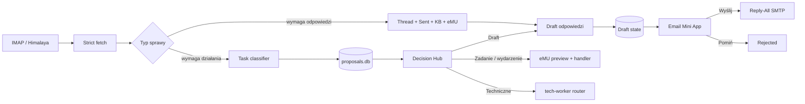

# Pipeline poczty: od wiadomości do decyzji

System ma dwa niezależne workflowy e-mailowe:

1. przygotowanie odpowiedzi i wysyłka po akceptacji,
2. rozpoznanie sprawy, która powinna stać się zadaniem, wydarzeniem albo analizą `tech-worker`.

To rozdzielenie chroni przed częstym błędem automatyzacji: potraktowaniem każdej wiadomości jak prostego „odpisz”.

## Mapa pipeline'u



## Workflow 1: draft odpowiedzi

### Harmonogram

`email-draft-generator` działa w dni robocze o 08:10, 09:10, ..., 15:10. Uruchomienia są przesunięte względem skanera zadań, aby oba procesy nie walczyły o tę samą skrzynkę w tej samej sekundzie.

### 1. Pobranie wiadomości

Wspólny moduł `email_fetcher.py` obsługuje Himalaya. Czyta:

- nowe wiadomości z INBOX,
- nagłówki i adresatów,
- pełną treść wybranej wiadomości,
- folder Sent, aby ustalić, czy odpowiedź już została wysłana.

Tryb `strict=True` rozróżnia trzy sytuacje:

| Wynik | Interpretacja |
|---|---|
| poprawne `[]` | skrzynka jest dostępna, ale nie ma nowych rekordów |
| timeout / błąd procesu | pipeline zatrzymuje się i raportuje błąd |
| niepoprawny JSON | pipeline nie aktualizuje checkpointu |

Dzięki temu awaria IMAP nie wygląda jak spokojny dzień bez poczty.

### 2. Deduplikacja

`draft_manager.py` sprawdza Message-ID i lifecycle. Podstawowe statusy:

```text
pending → sent
pending → rejected
pending → expired
```

Draft oczekujący, wysłany albo świadomie odrzucony nie jest generowany ponownie. Folder Sent jest dodatkową kontrolą na wypadek odpowiedzi wysłanej z telefonu lub innego klienta pocztowego.

### 3. Budowa kontekstu

Przed napisaniem odpowiedzi Hermes może połączyć:

| Źródło | Wkład do odpowiedzi |
|---|---|
| bieżący wątek | pytanie, ustalenia i język klienta |
| Sent | ostatnia odpowiedź oraz status „już obsłużone” |
| załączniki | screenshot, dokument, wiadomość MSG lub plik tekstowy |
| eMU | zadania, wydarzenia i bieżące ustalenia |
| baza wiedzy | podobne problemy oraz wcześniejsze rozwiązania |
| ERP vault | dokumentacja techniczna i sprawdzone przykłady |
| dostępność | realny termin spotkania lub dalszej analizy |

Kontekst ma być wystarczający do sensownej odpowiedzi, ale nie oznacza automatycznego wykonania technicznego zadania.

### 4. Treść draftu

Draft zawiera:

- odpowiedź w języku wiadomości,
- ustalenia wynikające ze źródeł,
- jawne pytania o brakujące dane,
- rozsądny termin bez obietnic niepotwierdzonych w kalendarzu,
- informację o analizowanych załącznikach,
- firmowy podpis HTML.

Stan `pending` jest zapisywany przed pokazaniem Mini App. Pozwala to bezpiecznie powtórzyć delivery bez ponownego generowania treści.

### 5. Telegram Mini App

`generate-draft-html.py` tworzy mobilną kartę z:

- nadawcą i tematem,
- krótką kwalifikacją sprawy,
- kontekstem użytym do odpowiedzi,
- pełną treścią draftu,
- listą załączników,
- przyciskami „Wyślij” i „Pomiń”.

HTML jest rejestrowany w prywatnym Artifact Serverze. Tailscale Serve wystawia stronę po HTTPS do Telegrama. Główne WebUI Hermesa nie jest publicznym endpointem tego procesu.

### 6. Akceptacja i SMTP

Kliknięcie przycisku uruchamia callback z komendą:

```text
/draft-ok_<message-id>
/draft-skip_<message-id>
```

`draft_cmd.py`:

1. odczytuje draft z kanonicznego stanu,
2. sprawdza, czy nadal ma status `pending`,
3. buduje wiadomość MIME HTML,
4. ustawia Reply-All oraz CC,
5. dodaje `In-Reply-To` i `References`,
6. dołącza podpis,
7. wysyła przez Himalaya/SMTP,
8. zmienia status na `sent` dopiero po potwierdzonym sukcesie.

Hasło SMTP pozostaje w chronionym magazynie konfiguracji, nie w repozytorium.

### 7. Feedback z Sent

`sent-feedback-daily` działa o 18:00. Porównuje zaakceptowane drafty z wiadomościami faktycznie widocznymi w Sent. To zamyka pętlę i pomaga wychwycić ręczne poprawki albo problem po stronie delivery.

## Workflow 2: e-mail jako draft działania

### Harmonogram

`email-to-task-scan` działa co 15 minut od 08:03 do 15:48 w dni robocze. Nie tworzy zadania w eMU.

### Klasyfikacja

Parser ocenia m.in.:

- czy e-mail oczekuje odpowiedzi,
- czy opisuje nowy problem lub zakres prac,
- czy jest kontynuacją istniejącego zadania,
- czy odpowiedź i zadanie powinny powstać razem,
- czy wiadomość ma sygnały techniczne,
- czy można wskazać klienta i istniejącą sprawę.

Progi decyzji:

| Confidence | Kolejka |
|---:|---|
| `>= 0.80` | `proposal_ready` |
| `0.50–0.79` | `manual_review` |
| `< 0.50` | `skip` |

Wysoka pewność oznacza „gotowe do pokazania człowiekowi”, nie „gotowe do automatycznego zapisu”.

### Proposal store

Propozycja trafia do `proposals.db` razem z Message-ID, klasyfikacją, rationale, kandydatem klienta, opisem, statusem i sygnałami technicznymi. Ten zapis jest wspólny dla źródeł e-mail oraz eMU.

Deduplikacja działa na dwóch poziomach:

- Message-ID i aktywny lifecycle,
- terminalny status poprzedniej propozycji.

Odrzucona, wykonana lub wygasła sprawa nie wraca przy każdym kolejnym skanie.

### Decision Hub

`proposal-notifier` pokazuje nowe pozycje co 15 minut o `:05`, `:20`, `:35` i `:50`. Operator może wybrać:

- przygotowanie odpowiedzi,
- przygotowanie wydarzenia,
- przygotowanie zadania eMU,
- przekazanie do `tech-worker`,
- pominięcie,
- odrzucenie.

Karta dla sprawy technicznej pokazuje także przyszłą treść zadania Kanban, skille oraz plan analizy. To jest właściwy „draft zadania do tech-worker”.

Szczegóły handoffu znajdują się w [pełnym workflowie](full-operational-workflow.md#ścieżka-c-draft-zadania-dla-tech-worker).

## Produkcyjne jobs związane z pocztą

| Job | Harmonogram | Funkcja |
|---|---|---|
| `mailops-email-alert` | co godzinę, 07:05–16:05 pn–pt | pilne sygnały i wyjątki |
| `email-draft-generator` | co godzinę, 08:10–15:10 pn–pt | draft odpowiedzi |
| `email-to-task-scan` | co 15 min, 08:03–15:48 pn–pt | draft działania / proposal |
| `proposal-notifier` | co 15 min, 08:05–15:50 pn–pt | Decision Hub w Telegramie |
| `sent-feedback-daily` | codziennie 18:00 | kontrola rzeczywiście wysłanych wiadomości |

## Granice bezpieczeństwa

- Scanner poczty nie wysyła wiadomości.
- Wysoka wartość confidence nie omija akceptacji.
- Callback obsługuje tylko zdefiniowane akcje i aktualny lifecycle.
- Status `sent` powstaje po potwierdzonym sukcesie SMTP.
- Błąd pobrania nie aktualizuje checkpointu.
- Tajne dane pocztowe i rzeczywiste treści wiadomości nie trafiają do repo.
- Sprawa techniczna może zostać przekazana do specjalisty, ale specjalista nie komunikuje się z klientem.
