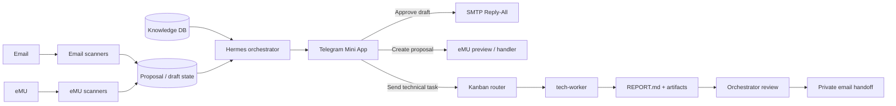
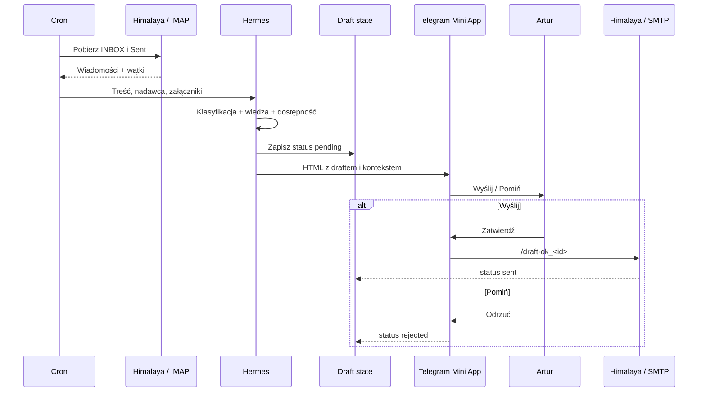
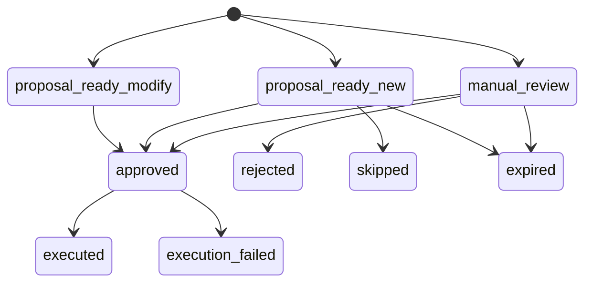
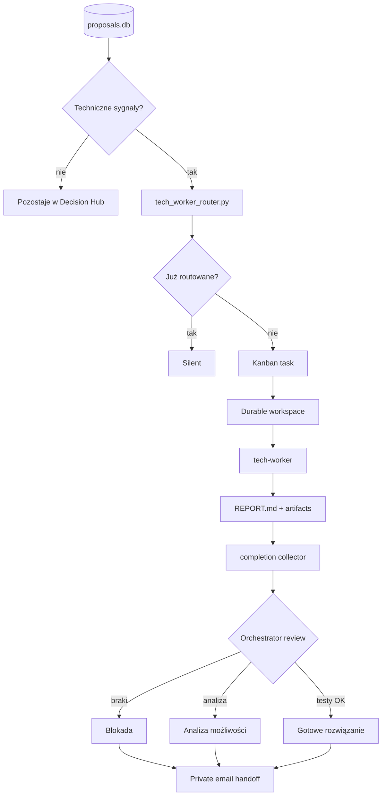
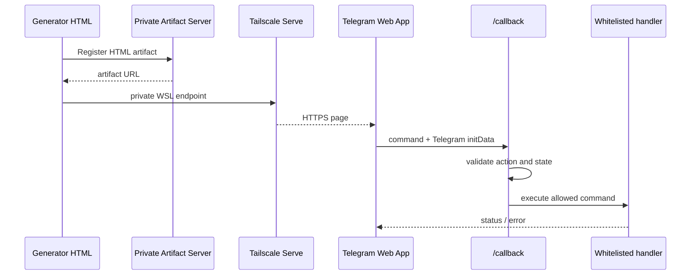

# Pełny workflow operacyjny

To jest techniczny opis systemu, który działa nad pocztą firmową i portalem eMU. Strona główna pokazuje skróconą wersję. Tutaj widać stan, harmonogramy, decyzje i granice odpowiedzialności.

> Zakres publiczny: architektura i procedury. Repo nie zawiera wiadomości klientów, zawartości prywatnej bazy wiedzy, danych logowania ani produkcyjnych parametrów środowiska.


## Model pracy

Hermes działa jako orkiestrator. Nie próbuje rozwiązać każdej sprawy w jednym przebiegu.

1. Osobny scanner odczytuje źródło.
2. System buduje kanoniczny zapis sprawy.
3. Agent dodaje kontekst i proponuje działanie.
4. Telegram Mini App pokazuje propozycję człowiekowi.
5. Dopiero zatwierdzona akcja trafia do właściwego handlera.
6. Sprawy techniczne dostaje osobny profil `tech-worker`.
7. Jego raport przechodzi niezależną kontrolę orkiestratora.



## Dwa różne rodzaje draftów

Słowo „draft” pojawia się w systemie w dwóch znaczeniach. Rozdzielenie ich jest ważne.

### Draft odpowiedzi e-mail

To gotowa treść odpowiedzi, ale jeszcze niewysłana. Stan znajduje się w `pending_drafts.json`. Akceptacja uruchamia handler SMTP.

### Draft działania

To propozycja dalszej pracy: utworzenie zadania, wydarzenia, odpowiedzi albo przekazania sprawy do `tech-worker`. Stan znajduje się w `proposals.db`. Akceptacja wybiera router, a nie wysyła automatycznie wiadomości.

## Ścieżka A: e-mail do draftu odpowiedzi



### Kolejne etapy

| Etap | Realny komponent | Co robi |
|---|---|---|
| Pobranie | `email_fetcher.py`, Himalaya | Czyta INBOX oraz Sent w trybie strict. Błąd połączenia nie wygląda jak pusta skrzynka. |
| Deduplikacja | `draft_manager.py` | Odrzuca wiadomości już wysłane, odrzucone lub nadal oczekujące. |
| Kontekst | email thread, eMU, vault, baza wiedzy | Łączy historię wątku, wcześniejsze sprawy, załączniki i dostępność. |
| Generowanie | Hermes + model jakościowy | Pisze odpowiedź zgodną z językiem oraz kontekstem wiadomości. |
| Podgląd | `generate-draft-html.py` | Buduje responsywną Mini App z treścią, źródłem i akcjami. |
| Decyzja | `/callback` → `draft_cmd.py` | Przyjmuje wyłącznie dozwolone polecenie z identyfikatorem draftu. |
| Wysyłka | Himalaya / SMTP | Ustawia Reply-All, CC, `In-Reply-To`, `References`, HTML i podpis. |
| Feedback | `sent-feedback-daily` | Porównuje draft z wiadomością, która faktycznie trafiła do Sent. |

Cron `email-draft-generator` działa co godzinę od 08:10 do 15:10 w dni robocze. Jeśli nie ma wiadomości wymagających odpowiedzi, wynik jest cichy.

## Ścieżka B: e-mail lub eMU do draftu zadania

Ten pipeline nie tworzy zadań automatycznie. Najpierw tworzy propozycję.

### Źródło e-mail

`email-to-task-scan` uruchamia się co 15 minut w godzinach pracy. Klasyfikator dzieli wiadomości na trzy kolejki:

| Confidence | Kolejka | Znaczenie |
|---:|---|---|
| `>= 0.80` | `proposal_ready` | propozycja nadaje się do pokazania operatorowi |
| `>= 0.50` | `manual_review` | sygnał jest niepełny albo niejednoznaczny |
| `< 0.50` | `skip` | brak wystarczających podstaw do zadania |

### Źródło eMU

`eMU assigned task tech scan` czyta przypisane zadania, komentarze i załączniki. Parser potrafi rozpakować pliki tekstowe oraz wiadomości MSG. Jeżeli najnowsze komentarze wskazują, że sprawa jest już rozwiązana albo czeka na weryfikację klienta, scanner nie tworzy kolejnej propozycji.

### Kanoniczna propozycja

Oba źródła zapisują wspólny format w `proposals.db`:

```text
source → message/task id → customer candidate → description
       → comments → attachments → confidence → technical signals
       → workflow action → lifecycle status → audit metadata
```

Przykładowy lifecycle:



Status końcowy blokuje ponowne utworzenie propozycji dla tej samej sprawy. Dodatkowo router korzysta z idempotency key.

## Decision Hub w Telegramie

`proposal-notifier` publikuje nowe propozycje o `:05`, `:20`, `:35` i `:50` w godzinach pracy. Mini App pokazuje:

- źródło i odnośnik do eMU,
- sugerowany tytuł oraz opis,
- rozpoznanego klienta i confidence,
- sygnały techniczne,
- podgląd przyszłej karty Kanban,
- skille, które dostanie `tech-worker`,
- ścieżkę przyszłego workspace,
- dozwolone decyzje.

Dla propozycji nietechnicznej dostępne są działania:

- utwórz draft odpowiedzi,
- przygotuj wydarzenie,
- przygotuj zadanie,
- pomiń.

Dla propozycji technicznej:

- wyślij do `tech-worker`,
- przygotuj draft odpowiedzi,
- pomiń,
- odrzuć.

Kliknięcie wysyła komendę do `/callback`. Handler waliduje identyfikator, action whitelist i stan propozycji. Przycisk nie omija tej warstwy.

## Ścieżka C: draft zadania dla tech-worker



### Filtr techniczny

Router nie reaguje na pojedyncze ogólne słowo. Ma dwie grupy sygnałów:

- mocne: SQL, MSSQL, Optima, Comarch, API, XML, CTI Produkcja, raport BI, błąd wydruku, trigger, widok SQL;
- słabe: BI, import, view, wydruk, integracja.

Jeden mocny sygnał wystarcza. Słabe muszą wystąpić co najmniej dwa. Dwuznaczne polskie słowa są zawężone kontekstem. „Zapytanie ofertowe” nie jest traktowane jak zapytanie SQL, a „indeks cen” jak indeks bazy danych.

### Treść karty Kanban

Router przygotowuje zadanie z:

- typem i identyfikatorem źródła,
- linkiem do eMU albo metadanymi e-maila,
- klientem i zgłaszającym,
- opisem, komentarzami i załącznikami,
- zadaniami powiązanymi,
- etapami analizy,
- listą dozwolonych baz testowych,
- zakazami dotyczącymi produkcji i komunikacji,
- wymaganym formatem raportu.

Parametry wykonania:

| Pole | Wartość |
|---|---|
| assignee | `tech-worker` |
| priority | `20` |
| max runtime | `90m` |
| workspace | osobny katalog dla propozycji |
| idempotency | `tech-worker-route:<proposal_id>` |
| wymagany output | `REPORT.md` + ewentualne artefakty |

### Skille specjalisty

Każda karta ładuje zestaw procedur:

- `mssql-wsl-connection`,
- `optima-knowledge-retrieval-maintenance`,
- `optima-dodatkowe-kolumny`,
- `optima-dodatkowe-funkcje`,
- `optima-bi-optimization`,
- `systematic-debugging`.

Specjalista może analizować i testować. Nie może:

- pisać do eMU,
- zmieniać produkcyjnej bazy,
- wysyłać wiadomości do klienta,
- przedstawiać wyniku bez dowodu weryfikacji.

DDL i DML są dozwolone wyłącznie na wskazanych bazach testowych, z kontrolą stanu i rollbackiem.

## Kontrakt REPORT.md

Raport jest trwałym artefaktem, nie treścią z pamięci sesji. Musi zawierać:

```markdown
## Źródło
## SUMMARY
## FINDINGS
## RECOMMENDED_ACTION
## ARTIFACTS
## VERIFICATION
## RISKS / BLOCKERS
## POSTMORTEM / LEARNING
```

Sekcja learning kończy się jedną z jawnych decyzji:

- `skill_update: <nazwa>` dla procedury, którą warto poprawić,
- `memory: <fakt>` tylko dla trwałego faktu środowiskowego,
- `learning: none`, jeśli nie powstała wiedza wielokrotnego użytku.

## Niezależna kontrola orkiestratora

Cron `tech-worker-orchestrator-review` działa pięć minut po jobie `tech-worker-proposal-router`. Kontroler:

1. znajduje zakończoną kartę routowaną,
2. potwierdza istnienie trwałego raportu,
3. sprawdza wszystkie wymagane sekcje,
4. zbiera SQL, konfiguracje i pozostałe artefakty,
5. odczytuje dowody testów,
6. klasyfikuje wynik.

Trzy możliwe statusy operacyjne:

| Status | Warunek |
|---|---|
| gotowe rozwiązanie techniczne | raport jest kompletny i zawiera pozytywną weryfikację |
| analiza rozwiązania i możliwości | raport jest kompletny, ale nie potwierdza gotowego wdrożenia |
| blokada / potrzeba decyzji | brakuje sekcji, danych, testu albo występuje blocker |

Dopiero potem powstaje krótki handoff dla operatora. Pełny raport i artefakty są dołączane do wiadomości e-mail wysyłanej na prywatny adres roboczy. Cron ma delivery `local`, więc surowy output nie trafia automatycznie na publiczny kanał Telegram.

## Telegram Mini Apps: warstwa techniczna



Produkcyjny zestaw generatorów obejmuje co najmniej:

- draft odpowiedzi e-mail,
- proposal / draft zadania,
- powiadomienie eMU,
- briefing operacyjny,
- raport i health view.

Artifact Server działa jako prywatna usługa w WSL. Link dla Mini App wystawia wyłącznie bezpieczny Tailscale Serve; główne WebUI Hermesa nie jest publicznym endpointem.

## Gdzie przechowywany jest stan

| Obszar | Kanoniczny stan | Dlaczego osobno |
|---|---|---|
| drafty e-mail | `pending_drafts.json` / draft state | prosty lifecycle wiadomości i szybki callback |
| propozycje działań | `proposals.db` | relacyjny lifecycle, wyszukiwanie, deduplikacja |
| kolejka wykonawcza | Kanban SQLite | assignment, lease, eventy, completion |
| workspace specjalisty | katalog zadania | trwałe raporty, SQL, dane testowe |
| eMU knowledge base | osobne SQLite + FTS5 + vectors | retrieval i historia synchronizacji |
| pamięć Hindsight | osobny provider | trwałe fakty, nie dane operacyjne spraw |
| historia cron | output i stan schedulera | diagnostyka bez zaśmiecania Telegrama |

Agent nie jest bazą danych. Każdy stan, który ma wpływ na ponowne wykonanie, ma własny trwały zapis.

## Rytm cronów

W konfiguracji działa 43 aktywnych jobs. Najważniejsza pętla w godzinach pracy wygląda tak:

```text
:01  eMU assigned task scan
:03  email-to-task scan
:04  eMU dual-read diagnostic
:05  proposal notifier
:07  tech-worker router
:12  orchestrator review
:14  tech pipeline watchdog

co godzinę o :10  email draft generator
co 30 minut       mail alert / eMU MSG enrichment
```

Przesunięcie minut ogranicza wyścigi. Scanner zapisuje propozycję przed notifierem, router działa po decyzji, a review ma czas na odczyt gotowego eventu completion.

Pełny katalog znajduje się w [cron-orchestration.md](cron-orchestration.md).

## Safety gates

| Ryzyko | Blokada |
|---|---|
| wysłanie niezaakceptowanego e-maila | status pending + jawne `/draft-ok_<id>` |
| ponowne wysłanie tej samej odpowiedzi | Sent check + draft lifecycle |
| duplikat zadania technicznego | proposal lifecycle + idempotency key |
| niepotrzebny routing sprawy biznesowej | mocne i kontekstowe sygnały techniczne |
| write do eMU przy samym odczycie | osobne read-only scanners i write handlers |
| zmiana produkcyjnej bazy podczas analizy | task contract + test databases + rollback |
| raport bez testów | wymagane sekcje + orchestrator review |
| ciche zatrzymanie pipeline | health checks i watchdogi |
| zalew komunikatów | `[SILENT]` przy braku działania |

## Czego to portfolio celowo nie pokazuje

- nazw i danych klientów,
- adresów e-mail,
- treści zgłoszeń i komentarzy,
- tokenów, haseł i plików środowiskowych,
- adresów baz i produkcyjnych parametrów połączeń,
- zawartości prywatnej bazy wiedzy,
- surowych promptów zawierających dane operacyjne.

Publiczny diagram jest wierny logice systemu, ale przykłady danych są syntetyczne.
