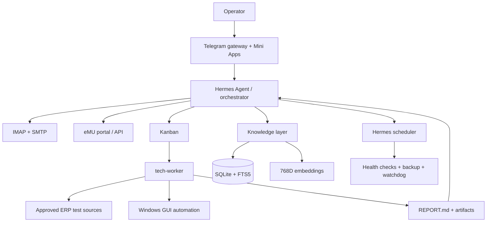

# Stack technologiczny

Ten dokument pokazuje klasy technologii i decyzje architektoniczne. Celowo nie publikuje nazw baz klientów, adresów hostów, portów produkcyjnych, modeli poświadczeń ani lokalnych ścieżek sekretów.

## Topologia

## 1. Runtime i orkiestracja

| Obszar | Technologia | Rola |
|---|---|---|
| System hosta | Windows + WSL2 | równoczesny dostęp do narzędzi Linux i aplikacji ERP na Windows |
| Framework agentowy | [Hermes Agent](https://github.com/NousResearch/hermes-agent) | sesje, skille, gatewaye, pamięć, cron i narzędzia |
| Język automatyzacji | Python | skanery, sync, klasyfikacja i integracje |
| Procesy | user services | gateway i usługi działające niezależnie od terminala |
| Scheduler | Hermes cron | 43 aktywne jobs z trwałym stanem |

Hermes jest provider-agnostic. Modele są dobierane do klasy zadania zamiast przypisywania jednego kosztownego modelu do całego systemu.

## 2. Warstwa modeli

| Klasa pracy | Strategia |
|---|---|
| Codzienne skanery i klasyfikacja | szybki model o stabilnym structured output |
| SQL, kod i diagnostyka ERP | model specjalistyczny + procedury domenowe |
| Ryzykowna analiza | silniejszy model + niezależna kontrola rodzica |
| Embeddings | lokalny lub prywatny runtime, wektor 768D |
| Deterministyczne operacje | skrypt bez LLM |

Routing modeli jest konfiguracją operacyjną i nie stanowi części publicznego kontraktu repo. Ważniejszy jest podział odpowiedzialności: LLM rozumuje, skrypt wykonuje deterministyczny krok, a człowiek zatwierdza efekt zewnętrzny.

## 3. Profile i delegacja

System rozdziela role na izolowane profile:

- **orchestrator** — poczta, eMU, Telegram, decyzje i koordynacja,
- **tech-worker** — techniczna analiza SQL/ERP i trwałe artefakty,
- **profil wiedzy/API** — wyspecjalizowany retrieval i dokumentacja.

Profile przekazują pracę przez Kanban i trwały workspace. Nie polegają na ulotnej pamięci rozmowy.

## 4. Poczta

| Komponent | Rozwiązanie |
|---|---|
| IMAP/SMTP | terminalowy klient poczty z obsługą wątków |
| Format | MIME HTML |
| Wątek | `In-Reply-To`, `References`, To i CC |
| Stan | osobny store pending/sent/skipped/expired |
| Interfejs decyzji | Telegram Mini App |
| Bezpieczeństwo | wysyłka dopiero po świadomej akceptacji |

Poświadczenia i podpis są ładowane z lokalnego credential store. Repo nie publikuje ich lokalizacji ani wartości.

## 5. eMU

| Komponent | Rozwiązanie |
|---|---|
| Odczyt portalu | REST tam, gdzie jest dostępny |
| Automatyzacja UI | Playwright dla elementów wymagających przeglądarki |
| Trudne kontrolki | kontrolowane operacje na Select2 |
| Sesja | wykrycie wygaśnięcia i ponowne uwierzytelnienie |
| Stan | lokalny snapshot + checkpointy |
| Deduplikacja | identyfikator źródła + lifecycle status |

Skanery pracują read-only. Operacja zapisu jest osobną, jawną ścieżką z walidacją parametrów i akceptacją operatora.

## 6. ERP i SQL

| Komponent | Rozwiązanie |
|---|---|
| Silnik | Microsoft SQL Server |
| Dostęp | kontrolowany klient CLI z WSL |
| Wiedza domenowa | wersjonowany ERP vault + skille |
| Testy | wyłącznie zatwierdzone źródła testowe |
| Produkcja | read-only, chyba że operator jawnie zatwierdzi inny zakres |
| Artefakty | SQL, konfiguracja, raport i dowody wykonania |

Publiczne repo nie zawiera nazw baz, endpointów, portów ani danych połączeń.

## 7. Knowledge layer

| Komponent | Rozwiązanie |
|---|---|
| Kanoniczny store | SQLite |
| Full-text | FTS5 + BM25 |
| Semantyka | embeddings 768D |
| Ranking | hybrydowy: lexical + semantic |
| Ingest | pełny sync partiami co 15 min |
| Enrichment | MSG i załączniki co 30 min |
| Embeddings | batch co 180 min |
| Quality loop | progress report + tygodniowy audyt |

Treść bazy wiedzy pozostaje prywatna. Portfolio pokazuje mechanikę retrieval, nie rekordy, tickety ani rozwiązania klientów.

## 8. Telegram Mini Apps

| Komponent | Rozwiązanie |
|---|---|
| Render | responsywny HTML generowany ze stanu propozycji |
| Hosting | prywatny artifact server wystawiany przez bezpieczny tunel |
| Wejście | Telegram Web App button |
| Akcja | `fetch()` do callbacku |
| Walidacja | allowlista akcji, ID rekordu, lifecycle i idempotencja |
| Feedback | status sukcesu/błędu w tej samej karcie |

Mini App nie jest dekoracją. Jest transakcyjną warstwą decyzji między analizą agenta a handlerem wykonawczym.

## 9. Pamięć i stan

| Warstwa | Rola |
|---|---|
| Pamięć trwała Hermesa | preferencje i stabilne fakty środowiskowe |
| Wyszukiwanie sesji | historia decyzji i kontekst poprzednich prac |
| Pamięć wektorowa | retrieval długoterminowy |
| SQLite state stores | proposals, drafty, powiadomienia, checkpointy |
| Activity log | audyt działań operacyjnych |
| Git | wersjonowanie skilli, dokumentacji i kodu |

Każdy typ stanu ma własny lifecycle. Pamięć użytkownika nie jest kolejką zadań, a proposal store nie jest bazą wiedzy.

## 10. MCP i automatyzacja pulpitu

| Komponent | Rola |
|---|---|
| Native MCP | integracje narzędziowe ładowane przez Hermes |
| Windows desktop control | obsługa aplikacji ERP i narzędzi Windows |
| SQL CLI | preferowana ścieżka deterministycznych zapytań |
| Browser automation | portal eMU i aplikacje webowe |

Automatyzacja GUI zaczyna od trybu background. Eskalacja do foreground następuje tylko po zweryfikowanym `no-op` i za zgodą użytkownika.

## 11. Obserwowalność

System ma osobne mechanizmy dla:

- health-checków pipeline’u,
- integralności proposal store,
- pamięci wektorowej,
- backupów logicznych,
- porównania dual-read,
- timeoutów tech-workera,
- infrastrukturalnego watchdoga,
- jakości knowledge layer.

Pusty wynik skryptu oznacza ciszę, nie błąd. Niezerowy exit generuje alarm. Dzięki temu Telegram nie staje się strumieniem logów.

## 12. Front portfolio

| Komponent | Rozwiązanie |
|---|---|
| HTML | semantyczny, bez frameworka |
| CSS | własny responsywny system wizualny |
| JavaScript | ES modules, bez zewnętrznego runtime |
| Hosting | GitHub Pages, statyczne pliki |
| Testy | Node test runner + browser QA |
| A11y | W3C HTML + axe WCAG 2.1 AA |
| SEO | canonical, Open Graph, social card, sitemap |

Brak frameworka front-endowego jest celowy: strona ma mały payload, zero hydracji i minimalną powierzchnię zależności.

## Granice publikacji

W publicznym repo są:

- architektura,
- kontrakty i lifecycle,
- syntetyczne przykłady,
- nazwy aktywnych jobs,
- publiczne technologie.

Nie ma:

- danych klientów ani identyfikatorów rekordów,
- treści wewnętrznej bazy wiedzy,
- nazw baz i parametrów połączeń,
- adresów e-mail i telefonów,
- tokenów, haseł, cookies ani kluczy API,
- surowych logów produkcyjnych.
