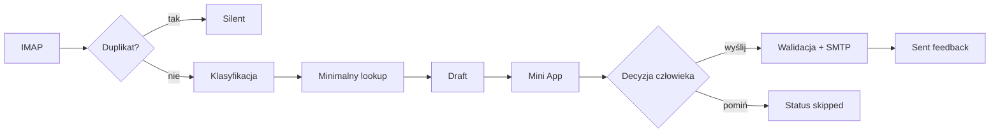

# Przykład: flow draftu e-mail

> Wiadomość, identyfikatory, firma, diagnoza i terminy są syntetyczne. Przykład nie zawiera danych klienta ani treści produkcyjnej bazy wiedzy.

## Scenariusz

Do skrzynki przychodzi zgłoszenie o błędzie w systemie ERP. System pobiera wątek, sprawdza stan, buduje bezpieczny draft i pokazuje go w Telegram Mini App. Wiadomość nie zostanie wysłana bez jawnej akceptacji.

## 1. Wiadomość przychodząca

```text
Od: klient@example.invalid
Do: erp@example.invalid
Temat: Błąd podczas zatwierdzania dokumentu

Dzień dobry,
podczas zatwierdzania dokumentu pojawia się komunikat o błędzie.
Proszę o sprawdzenie.
```

## 2. Pobranie w kontrolowanym oknie

```text
Cron: email-draft-generator (10 8-15 * * 1-5)
  → pobierz kandydatów z INBOX
  → sprawdź Sent dla tego wątku
  → sprawdź stan pending/sent/skipped
  → pobierz załączniki i metadane
  → przekaż minimalny potrzebny kontekst do analizy
```

Dwa zabezpieczenia blokują duplikat jeszcze przed LLM:

- odpowiedź istnieje już w Sent,
- message ID ma status końcowy w store draftów.

## 3. Klasyfikacja

```text
message_id: EX-MSG-001
intent: technical_incident
urgency: requires_review
product: ERP
customer: SYNTHETIC-CUSTOMER
confidence: medium
needs_reply: true
```

Confidence nie służy do automatycznej wysyłki. Pomaga zdecydować, czy zbudować draft, odłożyć do manual review czy pominąć wiadomość.

## 4. Lookup kontekstowy

System może sprawdzić równolegle:

```text
Wątek pocztowy
  → wcześniejsze wiadomości i adresaci Reply-All

Kalendarz / eMU
  → dostępność bez ujawniania innych wydarzeń

Knowledge layer
  → podobne prywatne procedury
  → treść źródeł pozostaje poza publicznym przykładem

ERP / SQL
  → tylko zatwierdzone źródło i zakres read-only
  → bez publikowania nazw baz ani wyników
```

Brak potwierdzonej diagnozy jest informacją. Agent nie powinien wypełniać luki pewnie brzmiącą poradą.

## 5. Draft

```html
<p>Dzień dobry,</p>

<p>Dziękuję za zgłoszenie. Sprawdzę wskazany błąd oraz kontekst
konfiguracji. Żeby potwierdzić przyczynę, proszę o przesłanie pełnej
treści komunikatu i informacji, którego typu dokumentu dotyczy.</p>

<p>Po otrzymaniu tych danych wrócę z potwierdzoną diagnozą albo
propozycją terminu wspólnej weryfikacji.</p>

<p>Pozdrawiam,<br>[podpis firmowy]</p>
```

Draft nie deklaruje rozwiązania, którego system nie zweryfikował.

## 6. Telegram Mini App

```text
┌─────────────────────────────────────┐
│  DRAFT ODPOWIEDZI                   │
│                                     │
│  klient@example.invalid             │
│  Błąd podczas zatwierdzania...      │
│                                     │
│  [podgląd odpowiedzi]               │
│                                     │
│  [Wyślij] [Pomiń] [Edytuj ręcznie]  │
│                                     │
│  źródła: wątek · KB · eMU           │
└─────────────────────────────────────┘
```

HTML artifact jest prezentowany w Telegramie, ale decyzja przechodzi przez whitelistowany callback.

## 7. Akceptacja i wysyłka

```text
/draft-ok_EX-MSG-001
  → pobierz rekord draftu
  → sprawdź status i expiry
  → waliduj akcję i message ID
  → zbuduj MIME HTML + Reply-All headers
  → wyślij przez SMTP z lokalnego credential store
  → status: sent
  → prywatne potwierdzenie operatorowi
```

Akcja jest idempotentna. Ponowne kliknięcie dla statusu `sent` nie wysyła drugiej wiadomości.

## 8. Stan

```json
{
  "EX-MSG-001": {
    "status": "sent",
    "generated_at": "2026-01-15T08:10:00Z",
    "sent_at": "2026-01-15T08:14:00Z",
    "expires_at": "2026-01-15T16:00:00Z"
  }
}
```

Następny tick pominie ten message ID. Codzienny `sent-feedback-daily` o 18:00 porówna status z wiadomościami rzeczywiście widocznymi w Sent.

## Podsumowanie przepływu



## Guardrails

- tylko syntetyczne dane w tym przykładzie,
- brak wysyłki bez akceptacji,
- Reply-All zachowuje kontekst wątku,
- załączniki są opisane w drafcie, ale nie publikowane,
- błędny lub wygasły callback kończy się bez wysyłki,
- status końcowy blokuje duplikat.
