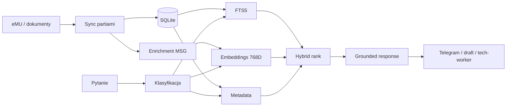

# Przykład: zapytanie do prywatnej bazy wiedzy

> Zapytanie, identyfikatory i wyniki są syntetyczne. Repo pokazuje mechanikę retrieval, ale nie publikuje treści eMU ani rozwiązań klientów.

## Scenariusz

Konsultant potrzebuje szybko znaleźć wcześniejszą procedurę dotyczącą konfiguracji wydruku w systemie ERP. Zadaje pytanie przez Telegram, a Hermes buduje odpowiedź wyłącznie z dozwolonych źródeł.

## 1. Pytanie

```text
Jak sprawdzić konfigurację wydruku seryjnego dla dokumentu sprzedaży?
```

## 2. Klasyfikacja

```text
intent: knowledge_query
product: ERP
keywords: wydruk seryjny, dokument sprzedaży, konfiguracja
scope: approved private knowledge sources
```

Agent nie odpowiada jeszcze. Najpierw uruchamia wyszukiwanie.

## 3. Retrieval hybrydowy

Trzy kroki wykonują się na tym samym kanonicznym store:

### FTS5

```sql
SELECT record_id, title, bm25(kb_fts) AS lexical_score
FROM kb_fts
WHERE kb_fts MATCH :query
ORDER BY lexical_score
LIMIT :candidate_limit;
```

### Similarity search

```python
query_vector = embed(question)  # 768D
semantic_candidates = vector_search(
    query_vector,
    limit=candidate_limit,
)
```

### Ranking

```text
final score = normalized lexical score
            + semantic similarity
            + metadata boosts
            - stale/low-quality penalties
```

Wagi są konfiguracją operacyjną i mogą różnić się zależnie od typu zapytania.

## 4. Syntetyczny wynik

```text
1. KB-EX-A · Procedura konfiguracji wydruku
   dopasowanie: wysokie
   źródło: prywatny artykuł wiedzy
   treść: [niepublikowana]

2. KB-EX-B · Diagnostyka szablonu dokumentu
   dopasowanie: średnie
   źródło: zanonimizowany wzorzec rozwiązania
   treść: [niepublikowana]

3. KB-EX-C · Uprawnienia i zakres wydruku
   dopasowanie: uzupełniające
   źródło: wewnętrzna procedura
   treść: [niepublikowana]
```

Prawdziwy interfejs pokazuje tytuł, dopasowanie, typ źródła i fragment potrzebny do uzasadnienia. Publiczny przykład nie zawiera fragmentów.

## 5. Odpowiedź operatorowi

```text
Baza wiedzy znalazła trzy powiązane źródła.

Najlepsze dopasowanie: KB-EX-A
Zakres: konfiguracja wydruku
Pewność: wysoka

[Otwórz prywatne źródło] [Użyj w drafcie] [Pokaż pozostałe]
```

Agent powinien:

- oddzielić fakty ze źródła od własnych wniosków,
- wskazać, gdy źródła są sprzeczne albo nieaktualne,
- nie cytować danych innego klienta,
- nie uznawać wysokiego similarity za dowód poprawności rozwiązania,
- poprosić o weryfikację, gdy wynik ma wpływ na produkcję.

## 6. Wykorzystanie w innych pipeline’ach

Ten sam retrieval wspiera:

- draft odpowiedzi e-mail,
- opis propozycji zadania,
- kontekst dla `tech-worker`,
- checklistę weryfikacji,
- poranny briefing.

Wynik retrieval jest kontekstem, nie poleceniem wykonania.

## Pipeline danych



## Rytm utrzymania

| Job | Częstotliwość | Rola |
|---|---|---|
| `emu-kb-full-sync-batch` | co 15 min | pobranie kolejnej partii |
| `emu-msg-enrich-batch` | co 30 min | przygotowanie treści MSG i załączników |
| `emu-kb-embedding-batch` | co 180 min | wektory dla nowych rekordów |
| `ERP KB FTS5 auto-rebuild` | codziennie 06:00 | pełnotekstowy indeks |
| `emu-kb-progress-report` | codziennie 07:00 | postęp i regresy |
| `emu-knowledge-weekly-report` | niedziela 12:00 | jakość knowledge layer |

## Guardrails prywatności

- lokalny store nie jest artefaktem repo,
- fragmenty z klientami nie trafiają do publicznego logu,
- ranking nie ujawnia źródła poza uprawnionym interfejsem,
- zewnętrzny model dostaje tylko minimalny potrzebny kontekst,
- publiczne przykłady używają wyłącznie identyfikatorów `EX-*`.
